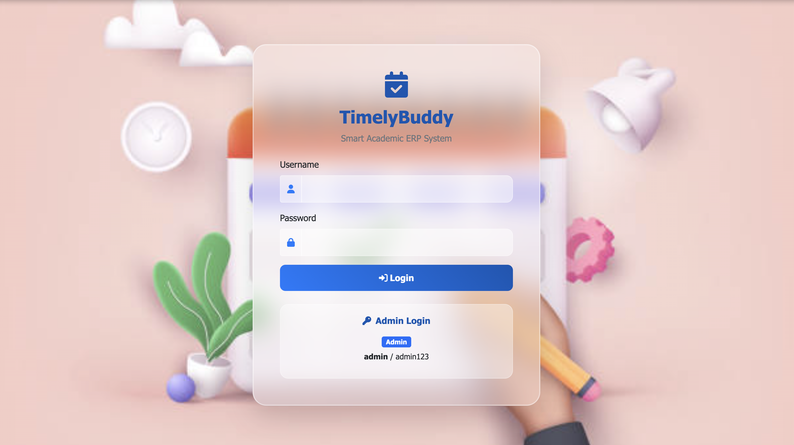
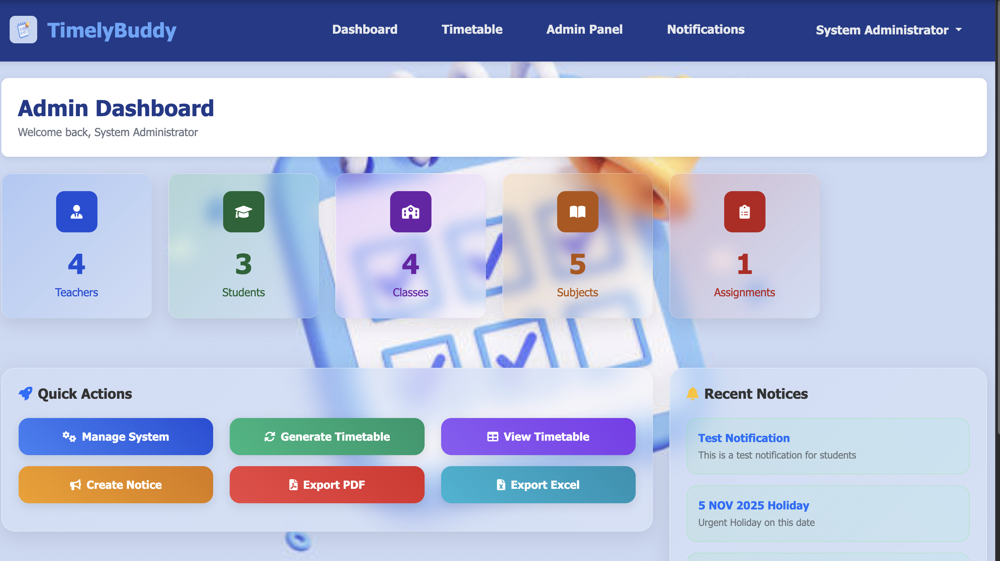
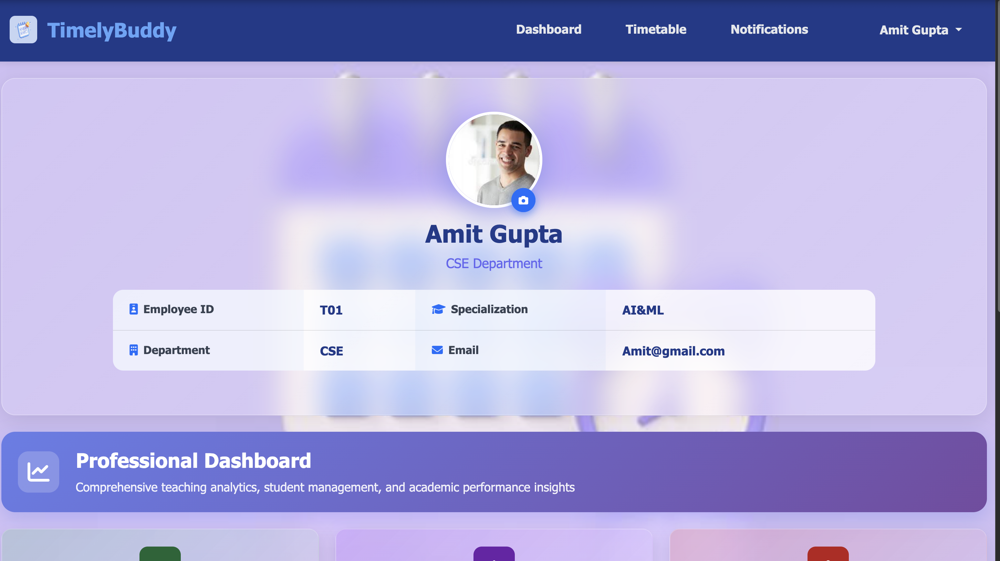
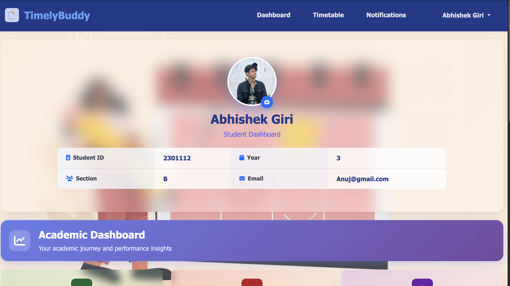

<h1 align="center">📚 TimelyBuddy - Smart Academic ERP System</h1>

<p align="center">
  🚀 A comprehensive academic ERP system for intelligent timetable scheduling with user authentication, role-based access, and complete academic management features.
</p>

<p align="center">
  
  
  
  
  
  
</p>
<br>

---

## 📖 Problem Statement
Educational institutions face significant challenges in creating conflict-free timetables, managing student attendance, assignments, and coordinating between teachers, students, and administrators. Traditional manual scheduling methods are time-consuming, error-prone, and lack the efficiency required for modern academic management.

<br>

---

## 💡 Our Solution
TimelyBuddy - Smart Academic ERP System is a full-stack web application built to:

- 📊 Generate conflict-free timetables using advanced graph coloring algorithms
- 👥 Manage users with role-based access (Admin, Teacher, Student)
- 📝 Handle assignments with photo/file upload capabilities
- ✅ Track student attendance with real-time marking
- 📈 Provide comprehensive dashboards with statistics
- 💾 Export timetables in PDF and Excel formats
<br>

---  

## 🚀 Features

✅  **Conflict-free Timetable Generation** using graph coloring and backtracking algorithms  
✅  **User Authentication** with secure login and role-based access control  
✅  **Role Management** for Admin, Teacher, and Student with different permissions  
✅  **Assignment Management** with photo/file upload and submission tracking  
✅  **Attendance System** with real-time marking and status tracking  
✅  **Dashboard Analytics** with comprehensive statistics and quick actions  
✅  **Export Functionality** for PDF and Excel timetable formats  
✅  **Notification System** for system-wide announcements  
✅  **Profile Management** with photo upload capabilities

<br>

---  

## 🛠️ Tech Stack

<div align="center">

<table>
<thead>
<tr>
<th>🖥️ Technology</th>
<th>⚙️ Description</th>
</tr>
</thead>
<tbody>
<tr>
<td></td>
<td>Python web framework for backend development</td>
</tr>
<tr>
<td></td>
<td>Lightweight database for data storage</td>
</tr>
<tr>
<td></td>
<td>Responsive CSS framework for UI design</td>
</tr>
<tr>
<td></td>
<td>Dynamic frontend interactions and AJAX</td>
</tr>
<tr>
<td></td>
<td>Modern markup language with Jinja2 templating</td>
</tr>
<tr>
<td></td>
<td>Core programming language with algorithms</td>
</tr>
<tr>
<td></td>
<td>Data manipulation for Excel export functionality</td>
</tr>
</tbody>
</table>

</div>

<br>

---

## 📁 Project Directory Structure

```
TimelyBuddy - Smart Academic ERP System/
├── 📂 database/                    # 🗄️ SQLite database files
│   └── 📄 timelybuddy.db          # 💾 Main database file
├── 📂 scheduling/                  # 🧮 Scheduling algorithms
│   ├── 📄 graph_coloring.py       # 🎨 Graph coloring algorithm
│   └── 📄 backtracking.py         # 🔄 Backtracking conflict resolution
├── 📂 static/                      # 🎨 Static assets
│   └── 📂 css/
│       └── 📄 style.css           # 💅 Custom styling
├── 📂 templates/                   # 📄 HTML templates
│   ├── 📄 base.html               # 🏗️ Base template layout
│   ├── 📄 login.html              # 🔐 Login page
│   ├── 📄 dashboard_admin.html     # 👑 Admin dashboard
│   ├── 📄 dashboard_teacher.html   # 👨‍🏫 Teacher dashboard
│   ├── 📄 dashboard_student.html   # 👨‍🎓 Student dashboard
│   ├── 📄 admin.html              # ⚙️ Admin management panel
│   ├── 📄 timetable.html          # 📅 Timetable display
│   ├── 📄 assignments_teacher.html # 📝 Teacher assignments
│   ├── 📄 assignments_student.html # 📚 Student assignments
│   ├── 📄 assignment_submissions.html # 📋 Submission tracking
│   ├── 📄 attendance_teacher.html  # ✅ Teacher attendance
│   ├── 📄 attendance_student.html  # 📊 Student attendance
│   ├── 📄 teacher_students.html    # 👥 Student management
│   └── 📄 notifications.html      # 🔔 Notifications
├── 📂 uploads/                     # 📁 User uploaded files
│   ├── 📂 profiles/               # 👤 Profile photos
│   ├── 📂 assignments/            # 📄 Assignment files
│   └── 📂 submissions/            # 📤 Student submissions
├── 📄 app.py                      # 🚀 Main Flask application
├── 📄 init_db.py                  # 🏗️ Database initialization
├── 📄 requirements.txt            # 📦 Python dependencies
├── 📄 .gitignore                  # 🚫 Git ignore rules
└── 📄 README.md                   # 📖 Project documentation

```
<br>

## 📸 Application Screenshots

| 📍 Page / Feature            | 📸 Screenshot                                              |
|:----------------------------|:-----------------------------------------------------------|
| Login Page                  |                        |
| Admin Dashboard             |                   |
| Teacher Dashboard           |               |
| Student Dashboard           |               |

<br>

---

## 🎯 User Roles & Permissions

### 👑 Admin
- Manage teachers, classes, classrooms, and subjects
- Generate and regenerate timetables
- View system statistics and analytics
- Export timetables in PDF/Excel formats
- Send system-wide notifications
- Assign teachers to subjects and classes

### 👨‍🏫 Teacher
- View personal timetable and assigned classes
- Create and manage assignments
- Mark student attendance
- Manage students in their classes
- View assignment submissions
- Upload profile photos

### 👨‍🎓 Student
- View class timetable and schedule
- Submit assignments with photo/file uploads
- View personal attendance records
- Access class information and notifications
- Manage profile and upload photos

<br>

---

## 📦 How to Run

### 📌 Prerequisites
- ✅ **Python 3.8+** installed
- ✅ **pip** package manager
- ✅ **Git** for cloning the repository

<br>

---  

### 🚀 Quick Start

1. **Clone the repository:**
   ```bash
   git clone https://github.com/abhishekgiri04/TimelyBuddy.git
   cd "TimelyBuddy - Smart Academic ERP System"
   ```

2. **Install dependencies:**
   ```bash
   pip install -r requirements.txt
   ```

3. **Initialize the database:**
   ```bash
   python init_db.py
   ```

4. **Run the application:**
   ```bash
   python app.py
   ```

5. **Access the application:**
   ```
   http://localhost:5001
   ```

### 🔐 Default Login Credentials

**Admin Account:**
- Username: `admin`
- Password: `admin123`

**Note:** Only admin account is created by default. Teachers and students need to be added through the admin panel after login.

### 🔧 Troubleshooting

**Port already in use:**
```bash
# The app will automatically find an available port
# Check the console output for the actual port number
```

**Database issues:**
```bash
# Reinitialize the database
python init_db.py
```

<br>

---

## 📖 Core Components

* **app.py** — Main Flask application with all routes and logic
* **init_db.py** — Database schema creation and initialization
* **graph_coloring.py** — Advanced scheduling algorithm implementation
* **backtracking.py** — Conflict resolution for timetable generation
* **base.html** — Base template with navigation and common elements
* **dashboard templates** — Role-specific dashboards for different users
* **assignment system** — Complete assignment management with file uploads
* **attendance system** — Real-time attendance marking and tracking

<br>

---

## 🌐 Key Routes

```bash
# Authentication
GET  /                  # Login page
POST /login            # User authentication
GET  /logout           # User logout

# Dashboard Routes
GET  /dashboard        # Role-based dashboard redirect
GET  /admin_dashboard  # Admin dashboard
GET  /teacher_dashboard # Teacher dashboard
GET  /student_dashboard # Student dashboard

# Timetable Management
GET  /admin            # Admin management panel
GET  /generate_timetable # Generate new timetable
GET  /timetable        # View timetable
GET  /export/pdf       # Export timetable as PDF
GET  /export/excel     # Export timetable as Excel

# Assignment System
GET  /assignments      # Assignment management
POST /create_assignment # Create new assignment
POST /submit_assignment # Submit assignment
POST /upload_assignment_photo # Upload assignment files

# Attendance System
GET  /attendance       # Attendance management
POST /mark_attendance  # Mark student attendance
```
<br>

---

## 🧪 Testing

```bash
# Test the application
python app.py

# Access the application
# Admin: http://localhost:5001 (admin/admin123)
# Note: Create teachers and students through admin panel
```

## ⚠️ Common Issues

**Port already in use:**
- The application automatically finds an available port
- Check console output for the actual port number

**Database connection issues:**
```bash
# Reinitialize the database
python init_db.py
```

**Missing dependencies:**
```bash
# Reinstall requirements
pip install -r requirements.txt
```

**File upload issues:**
- Ensure the `uploads/` directory has proper permissions
- Check file size limits in the application

<br>

---

## 📊 Performance Metrics

- **100% Conflict-Free** — Timetable generation with zero scheduling conflicts
- **Graph Coloring Algorithm** — Advanced mathematical approach for optimization
- **Real-time Processing** — Instant attendance marking and assignment uploads
- **Multi-user Support** — Concurrent access for multiple users
- **Responsive Design** — Works seamlessly on desktop and mobile devices
- **Secure Authentication** — Role-based access control with encrypted passwords

<br>

---

## 🌱 Future Scope
- 📱 **Mobile Application** — Native mobile app for iOS and Android
- 🔔 **Email/SMS Notifications** — Automated alerts for assignments and attendance
- 📅 **Calendar Integration** — Sync with Google Calendar and Outlook
- 📊 **Advanced Analytics** — Detailed reports and performance insights
- 🌐 **API Development** — RESTful APIs for third-party integrations
- 🎓 **Multi-semester Support** — Handle multiple academic terms
- 🏢 **Resource Booking** — Laboratory and equipment reservation system
- 🔐 **Enhanced Security** — Two-factor authentication and audit logs

<br>

---  

## 🎓 Algorithms Used

### Graph Coloring Algorithm
- **Purpose:** Assigns time slots to subjects avoiding conflicts
- **Complexity:** O(V²) where V is the number of subjects
- **Benefits:** Ensures no teacher/classroom conflicts

### Backtracking Algorithm
- **Purpose:** Resolves scheduling conflicts and constraints
- **Approach:** Systematic exploration of solution space
- **Benefits:** Finds optimal solutions with constraint satisfaction

### Constraint Satisfaction
- **Teacher Availability:** Respects teacher time preferences
- **Room Capacity:** Ensures adequate space for class sizes
- **Subject Requirements:** Handles lab/theory session needs

<br>

---

## 📞 Help & Contact  

> 💬 *Got questions or need assistance with TimelyBuddy?*  
> We're here to help with technical support and collaboration!

<div align="center">

<b>👤 Abhishek Giri</b>  
<a href="https://www.linkedin.com/in/abhishek-giri04/">
  
</a>  
<a href="https://github.com/abhishekgiri04">
  
</a>  
<a href="https://t.me/AbhishekGiri7">
  
</a>

<br/>

---

**📚 Built with ❤️ for Academic Excellence**  
*Making Class Scheduling Smart, Simple, and Efficient!*

</div>

---

<div align="center">

**© 2025 TimelyBuddy - Smart Academic ERP System. All Rights Reserved.**

</div>